## ▪️ Deskripsi

Meingga Fastprint adalah sebuah aplikasi web dengan PHP framework CodeIgniter 3(HMVC) dan RDBMS PostgreSQL. pada aplikasi ini terdiri dari 3 module yaitu: produk, kategori, dan status. setiap module terdapat fitur CRUD(Create, Read, Update, and Delete) dan fitur get data ke API FASTPRINT INDONESIA.

## ▪️ ERD (Entity Relationship Diagram)

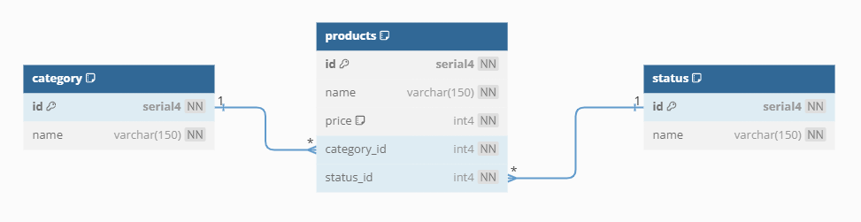

- \* TOOLS: https://dbdiagram.io/d

  - SCRIPT ERD

  ```
  Table "category" {
      "id" serial4 [not null]
      "name" varchar(150) [not null]

      Indexes {
          id [pk]
      }
  }

  Table "status" {
      "id" serial4 [not null]
      "name" varchar(150) [not null]

      Indexes {
          id [pk]
      }
  }

  Table "products" {
      "id" serial4 [not null]
      "name" varchar(150) [not null]
      "price" int4 [not null, default: 0]
      "category_id" int4 [not null]
      "status_id" int4 [not null]

      Indexes {
          id [pk]
      }
  }

  Ref:"category"."id" < "products"."category_id"

  Ref:"status"."id" < "products"."status_id"
  ```

- \* IMPLEMENTASI ERD (MEMBUAT DATABASE)

  Pada aplikasi ini saya menggunakan RDBMS PostgresSQL

  1. Buat Database dengan nama DB_FASTPRINT

     ```
     CREATE DATABASE DB_FASTPRINT;
     ```

  2. Buat Table category, status, dan product pada schema public DB_FASTPRINT

     ```
     CREATE TABLE category (
         id serial4 NOT NULL,
         name varchar(150) NOT NULL,
         PRIMARY KEY (id)
     );

     CREATE TABLE status(
         id serial4 NOT NULL,
         name varchar(150) NOT NULL,
         PRIMARY KEY (id)
     );

     CREATE TABLE products (
         id serial4 NOT NULL,
         name varchar(150) NOT NULL,
         price int4 NOT NULL default 0,
         category_id int4 NOT NULL,
         status_id int4 NOT NULL,
         PRIMARY KEY (id),
         FOREIGN KEY (category_id) REFERENCES category(id),
         FOREIGN KEY (status_id) REFERENCES status(id)
     );
     ```

## ▪️ Instalasi

Berikut adalah langkah-langkah untuk menginstal dan menjalankan aplikasi.

### Prasyarat

Pastikan sistem Anda memenuhi prasyarat berikut sebelum menggunakan aplikasi:

- ✔️ PHP versi 7.4 (_disarankan_), php extention yang wajib di aktifkan: cURL(untuk bisa hit api fastprint), pgsql, pdo_pgsql
- ✔️ PostgreSQL 14.5
- ✔️ Git
- ✔️ Code Editor (phpstrom/vscode/sublime text/dll)
- ✔️ XAMPP/LAMPP/LARAGON/DOCKER/dll

### Langkah-langkah Instalasi

1.  Clone repositori dari GitHub:

    ```bash
    git clone https://github.com/meingga/fastprintxmeingga.git
    ```

2.  Configurasi _application/config/development/database.php_

    Ganti _hostname_, _port_, _username_, _password_, dan _database_ anda

        ```
        $db['default'] = array(
            'dsn'			=> '',
            'hostname' 		=> 'localhost', // HOSTNAME PGSQL
            'port'     		=> 5432, // PORT PGSQL (optional bisa dihapus 'port' => 5432, jika port PGSQL anda default 5432)
            'username' 		=> 'postgres', // USERNAME PGSQL
            'password' 		=> 'postgres', // PASSWORD PGSQL
            'database' 		=> 'DB_FASTPRINT', // DB_NAME PGSQL
            'dbdriver' 		=> 'postgre',
            'dbprefix' 		=> '',
            'pconnect' 		=> TRUE,
            'db_debug' 		=> (ENVIRONMENT !== 'production'),
            'cache_on' 		=> FALSE,
            'cachedir' 		=> '',
            'char_set' 		=> 'utf8',
            'dbcollat' 		=> 'utf8_general_ci',
            'swap_pre' 		=> '',
            'encrypt' 		=> FALSE,
            'compress' 		=> FALSE,
            'stricton' 		=> TRUE,
            'failover' 		=> array(),
            'save_queries' 	=> TRUE
        );
        ```

3.  Selesai lalu jalankan sesuai dengan environment local anda

## ▪️ STRUKTUR APLIKASI

```
│ ...
│   index.php
│   README.md                           // DOKUMENTASI
│
├───application
│   │   ...
│   ├───config
│   │   │  ...
│   │   └───development
│   │           database.php            // KONFIGURASI DATABASE DEVELOPMENT
│   │...
│   ├───libraries
│   │       ...
│   │       Restcurl.php                // LIBRARY RESTCURL
│   │...
│   ├───modules                         // MODULES HMVC
│   │   ├───home                        // MODULE HOME/DOCUMENTATION
│   │   │   ├───controllers
│   │   │   │       Home.php
│   │   │   │
│   │   │   └───views
│   │   │           home.php
│   │   │
│   │   ├───master                      // MODULE MASTER CATEGORY AND STATUS
│   │   │   ├───controllers
│   │   │   │       Master.php
│   │   │   │
│   │   │   ├───models
│   │   │   │       Category_model.php
│   │   │   │       Status_model.php
│   │   │   │
│   │   │   └───views
│   │   │           category.php
│   │   │           status.php
│   │   │
│   │   └───products                    // MODULE PRODUCTS
│   │       ├───controllers
│   │       │       Products.php
│   │       │
│   │       ├───models
│   │       │       Products_model.php
│   │       │
│   │       └───views
│   │               products.php
│   │
│   ├─── ...
│   │
│   └───views
│       │...
│       └───_template                   // MAIN TEMPLATE
│               footer.php
│               header.php
│               index.php
│               sidebar.php
│
├───assets
│   │   ...
│   └───js
│       │   ...
│       └───pages                       // JS PAGES
│           │   index.html
│           │
│           ├───category                // JS PAGES MODULE CATEGORY
│           │       index.html
│           │       index.js
│           │
│           ├───home                    // JS PAGES MODULE HOME
│           │       index.html
│           │       index.js
│           │
│           ├───products                // JS PAGES MODULE PRODUCT
│           │       index.html
│           │       index.js
│           │
│           └───status                  // JS PAGES MODULE STATUS
│                   index.html
│                   index.js
│ ...
```

## ▪️ MODULE APLIKASI

### 0. MODULE HOME/DOCUMENTATION

Tampilan Halaman Dokumentasi membaca file _README.md_

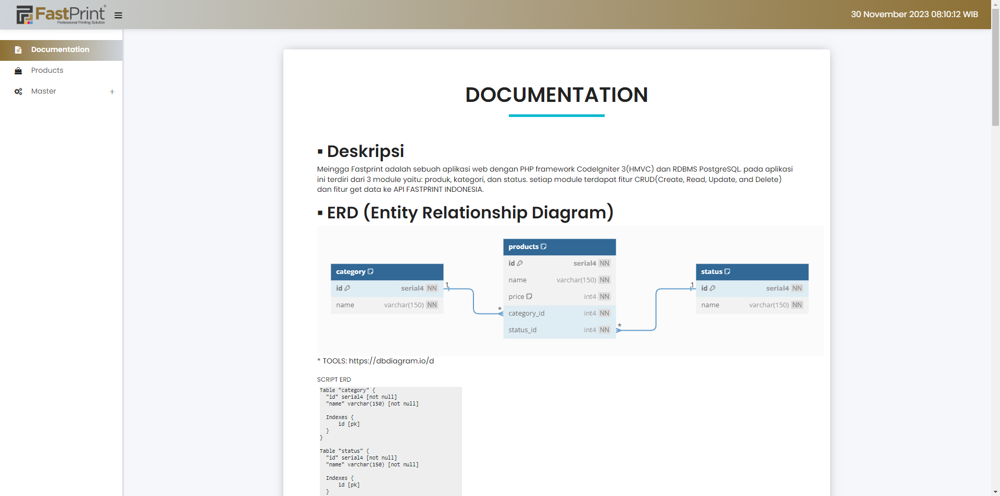

### 1. MODULE PRODUCT

Tampilan Halaman Produk.

terdapat fitur lihat data hanya status `bisa dijual`, lihat semua data, tambah produk, edit produk, hapus produk, dan ambil data dari api fastprint lalu menyimpan ke database.

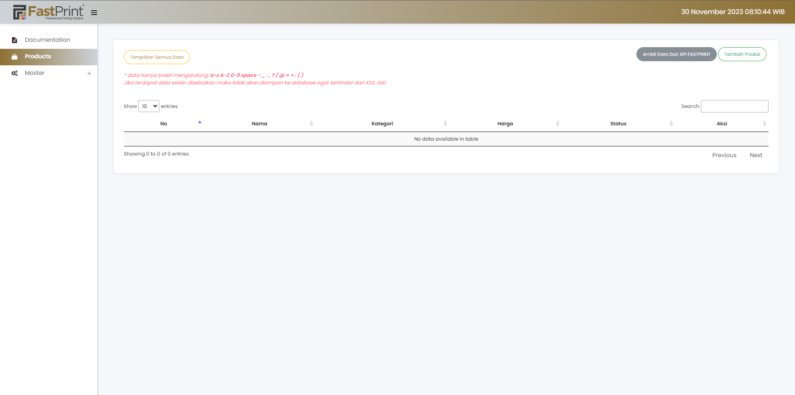

Tampilan Halaman Produk hanya menampilkan produk dengan status `bisa dijual` setelah get data dari api fastprint.

note:\* data hanya boleh mengandung: a-z A-Z 0-9 space - \_ . , ? / @ = + : ( )
Jika terdapat data selain disebutkan maka tidak akan disimpan ke database agar terhindar dari XSS, dsb

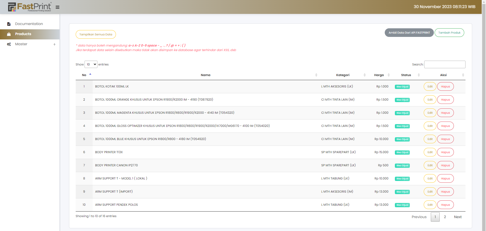

Tampilan Halaman Produk menampilkan semua produk.

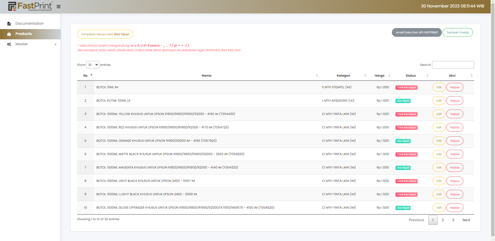

Tampilan Halaman Produk form menambahkan produk.

semua input form data wajib diisi dan untuk harga hanya bisa diinput angka

note:\* data hanya boleh mengandung: a-z A-Z 0-9 space - \_ . , ? / @ = + : ( )
Jika terdapat data selain disebutkan maka tidak akan disimpan ke database agar terhindar dari XSS, dsb

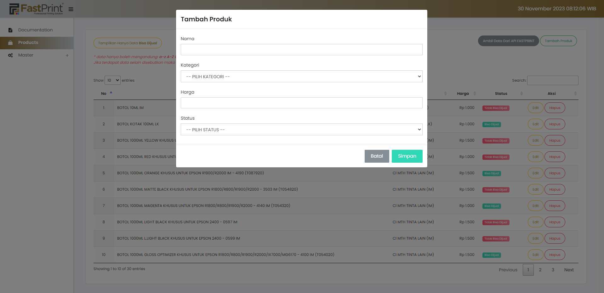

Tampilan Halaman Produk form mengedit produk.

semua input form data wajib diisi dan untuk harga hanya bisa diinput angka

note:\* data hanya boleh mengandung: a-z A-Z 0-9 space - \_ . , ? / @ = + : ( )
Jika terdapat data selain disebutkan maka tidak akan disimpan ke database agar terhindar dari XSS, dsb


Tampilan Halaman Produk menghapus produk.

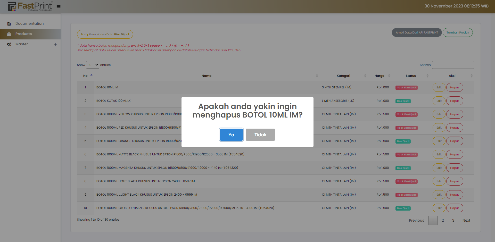

### 2. MODULE MASTER CATEGORY

Tampilan Halaman Master Kategori.

terdapat fitur lihat semua data, tambah kategori, edit kategori, dan hapus kategori.

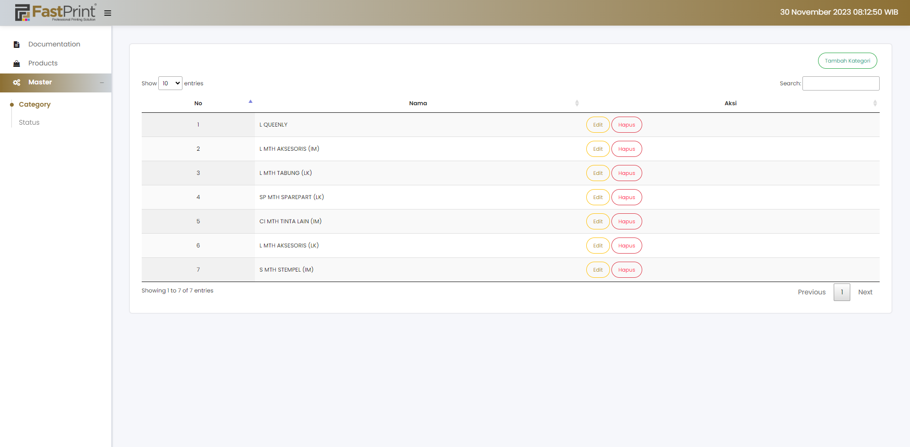

Tampilan Halaman Master Kategori untuk menambahkan kategori.

input nama kategori wajib diisi

note:\* data hanya boleh mengandung: a-z A-Z 0-9 space - \_ . , ? / @ = + : ( )
Jika terdapat data selain disebutkan maka tidak akan disimpan ke database agar terhindar dari XSS, dsb


Tampilan Halaman Master Kategori untuk mengedit kategori.

input nama kategori wajib diisi

note:\* data hanya boleh mengandung: a-z A-Z 0-9 space - \_ . , ? / @ = + : ( )
Jika terdapat data selain disebutkan maka tidak akan disimpan ke database agar terhindar dari XSS, dsb

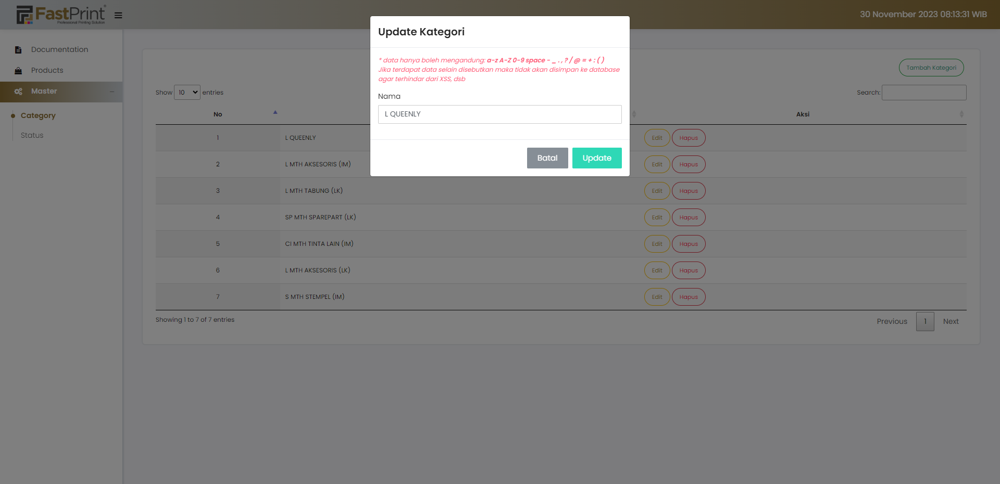

Tampilan Halaman Master Kategori untuk menghapus kategori.

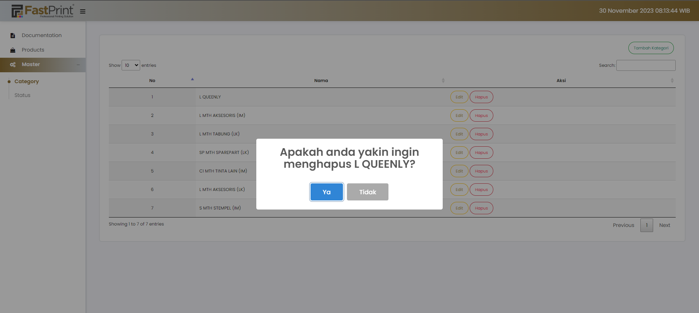

### 3. MODULE MASTER STATUS

Tampilan Halaman Master Status.

terdapat fitur lihat semua data, tambah status, edit status, dan hapus status.

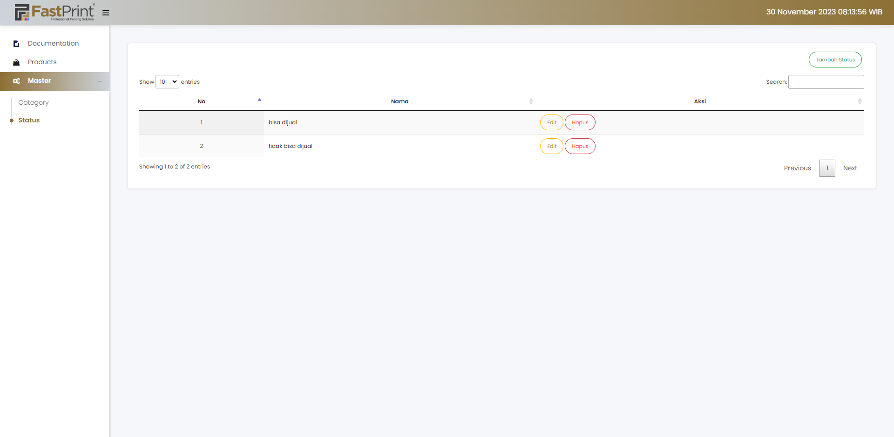

Tampilan Halaman Master Status untuk menambahkan status.

input nama status wajib diisi

note:\* data hanya boleh mengandung: a-z A-Z 0-9 space - \_ . , ? / @ = + : ( )
Jika terdapat data selain disebutkan maka tidak akan disimpan ke database agar terhindar dari XSS, dsb

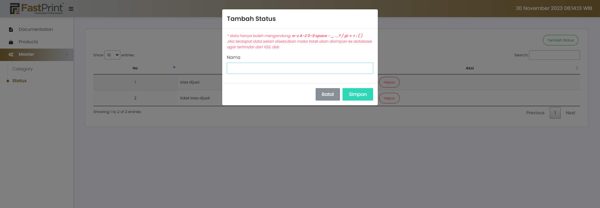

Tampilan Halaman Master Status untuk mengedit status.

input nama status wajib diisi

note:\* data hanya boleh mengandung: a-z A-Z 0-9 space - \_ . , ? / @ = + : ( )
Jika terdapat data selain disebutkan maka tidak akan disimpan ke database agar terhindar dari XSS, dsb

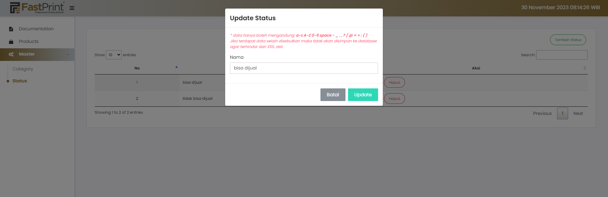

Tampilan Halaman Master Status untuk menghapus status.

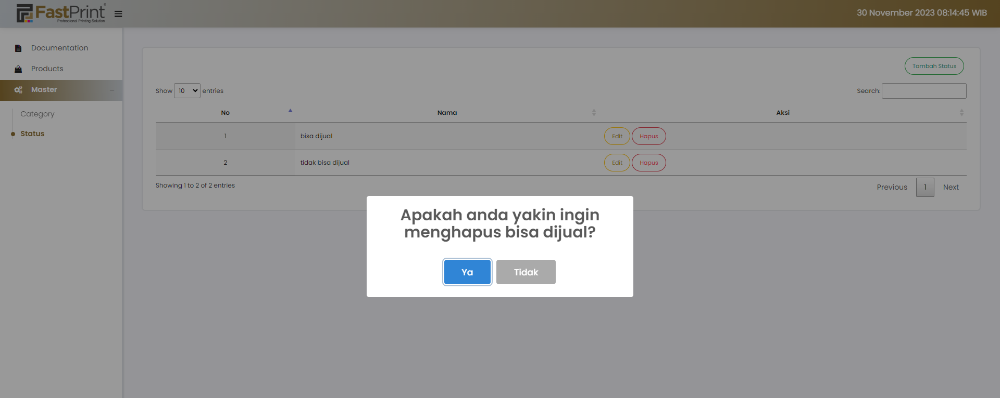

## ▪️ KONTAK

Jika ada yang ingin ditanyakan/didiskusikan bisa menghubungi:

```
email: fahmifaqih1257@gmail.com
linkedin: https://www.linkedin.com/in/fahmifaqihem
```
